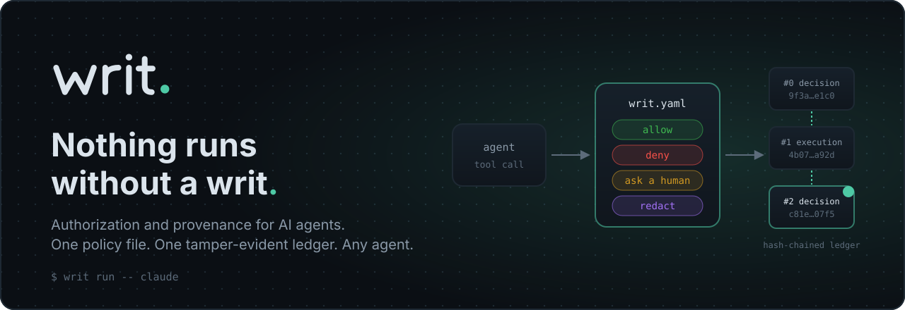

<div align="center">



Your agent asks. Your policy decides. The ledger remembers.

[](https://github.com/writ-agent/writ/actions/workflows/ci.yml)
[](LICENSE)
[](rust-toolchain.toml)
[](#status)

[Website](https://writ-omega.vercel.app) · [Docs](docs/README.md) · [Threat model](docs/THREAT_MODEL.md) · [Changelog](CHANGELOG.md)



</div>

A writ is authority to act, and the written record that it was authorized. That is
the product: every tool call an AI agent makes is checked against one policy file
before it runs, and written to one hash-chained ledger after.

For developers who hand agents real credentials, and for the platform teams who
answer for what those agents did.

## Install

```bash
cargo install --path crates/writ-cli      # prebuilt binaries, brew, npx and curl|sh
                                          # land with the release pipeline
cp examples/writ.yaml writ.yaml
writ run -- claude
```

No daemon, no images, no account. The default backend is the host OS, and the
first run creates `.writ/ledger.jsonl` next to your policy. For a SQLite
ledger, build with `--features sqlite` and pass `--ledger .writ/ledger.db`.

## The policy that produced that session

`writ.yaml` is the whole surface. Four verdicts, first match wins, unmatched
calls hit `default`.

```yaml
version: 1
default: ask                          # --yolo flips this to allow. Nothing else does.

rules:
  - id: block-destructive-shell
    when: tool == "bash" and command matches "rm -rf|mkfs|dd if=|:\(\)\{"
    verdict: deny
    reason: "Destructive system command. Narrow the path and retry."

  - id: protect-production-db
    when: tool startswith "postgres" and query matches "(?i)(DROP|TRUNCATE|ALTER)"
    verdict: ask
    irreversible: true                # excluded from automated replay
    timeout: 5m

  - id: egress-allowlist
    when: tool == "http" and not url.host in hosts.allowed
    verdict: deny

  - id: mask-pii
    when: tool startswith "postgres"
    verdict: redact
    patterns: ["[A-Za-z0-9._%+-]+@[A-Za-z0-9.-]+\\.[A-Za-z]{2,}"]

hosts:
  allowed: [api.github.com, registry.npmjs.org, "*.internal.acme.com"]
```

A denial is not a dead end. The agent receives the rule id, the human reason and
the `writ.yaml:6` that produced it, so it can correct itself instead of retrying
blind. The file lives in your repo, so the policy travels with the code and
reviews like code.

Start from a pack instead: `writ policy add terraform-safety` · `k8s-prod` ·
`pii-redaction`.

## The part that survives the session

Logs are what an application chose to write. A ledger is evidence: every call,
its verdict, the rule that decided it, who approved it, and the hash of the
record before it.

<div align="center">

</div>

Editing one line breaks the chain from that record onward, and `writ verify`
names the record it broke at. Nothing is captured beyond metadata and hashes
unless you turn content capture on, and Writ sends nothing anywhere — there is no
telemetry to opt out of.

## How it works

```
your agent, unchanged     Claude Code · Codex · LangGraph · your own loop
         │
         │  tool call intercepted
         ▼
┌─ writ ──────────────────────────────────────────────────────┐
│  1  INTERCEPT   mcp proxy  ·  process wrap  ·  sdk hook      │
│  2  DECIDE      writ.yaml → allow · deny · ask · redact      │
│  3  RECORD      hash-chained ledger  +  OTel GenAI span      │
└─────────┬───────────────────────────────────────────────────┘
          │  approved calls only
          ▼
   sandbox backend (local-os · docker · …)   ·   MCP servers
```

Writ wraps agents; it never asks you to adopt a runtime. The decision point is
the same in all three interception modes, and so is the record.

## Commands

| | |
|---|---|
| `writ run -- <agent>` | wrap an agent process under policy |
| `writ proxy --mcp --server <name> -- <cmd>` | govern every call to an MCP server |
| `writ log` · `writ show <call-id>` | what did my agent actually do last night |
| `writ verify` | is this ledger still the one that was written |
| `writ replay <session> --candidate <file>` | what would this policy have done to last week's run |
| `writ policy test` | unit-test rules against recorded fixtures |
| `writ doctor` | what is governed, and what is blind |
| `writ report` | one self-contained HTML file to hand to someone else |

## What writ does not do

Writ governs **actions**, not reasoning.

- **It does not stop prompt injection.** It shrinks the blast radius: least
  privilege, egress allow-lists, and a human gate on irreversible calls.
- **The ledger is tamper-evident, not tamper-proof.** Local verification catches
  edited records and broken links; anyone with write access can still delete the
  whole unanchored file. Transparency-log anchoring is on the roadmap and is the
  only thing that closes that gap.
- **MCP-proxy-only mode is partial coverage.** The agent's own shell, file writes
  and direct HTTP go around it. Pair mode A with process wrap or SDK hooks, and
  run `writ doctor`, which says this out loud rather than scoring itself.
- **It does not reverse side effects.** A denied call never ran; an approved one
  is yours.

Full residual-risk table: [docs/THREAT_MODEL.md](docs/THREAT_MODEL.md).

## Compatibility

| Layer | Today | Next |
|---|---|---|
| Agents | any, via `run` or `proxy` | SDK hooks: LangGraph, OpenAI Agents SDK, Claude Agent SDK |
| Interception | MCP stdio proxy, process wrap (launch supervision) | SSE + streamable HTTP, `writ run` inside the kernel boundary |
| Policy engines | native DSL, Rego, Cedar — one verdict IR, one fixture corpus | — |
| Sandbox backends | local-os with a kernel boundary (Landlock + seccomp · AppContainer + Job Object · Seatbelt), docker | microsandbox, e2b/firecracker, k8s |
| Ledger stores | JSONL (every platform), SQLite WAL (`sqlite` feature) | Postgres + object store, signed receipts |
| Platforms | macOS, Linux, Windows — CI builds all three | six release targets |

## Compared to the neighbours, fairly

- **Agent hooks** (vendor hooks, the Leash/Fence/Cordon cluster) — per-agent and
  per-machine, with no portable policy and no verifiable record. Writ's policy
  moves with the repo; the ledger outlives the session.
- **Sandboxes** (E2B, microsandbox, Dagger) — real isolation, but no per-call
  decision point, no "ask me first", and no evidence of what was attempted. Writ
  drives them rather than replacing them.
- **MCP gateways** (Docker MCP Gateway, ContextForge) — govern MCP traffic, and
  are blind to the shell command the agent runs itself.
- **Observability** (Langfuse, Phoenix, LangSmith) — they watch. They cannot stop
  anything, and their output is application logs, not evidence.

## Status

Pre-release. The core spine, all three policy engines, both workstation
ledger stores and the kernel sandbox are built and tested on Linux, macOS
and Windows in CI; the enterprise wave is in progress. Twelve crates, one
frozen record schema.

| Wave | Scope | State |
|---|---|---|
| 0 | Frozen contracts, threat model, ADRs, CI | done |
| 1 | Native policy engine, ledger + verify, MCP stdio proxy, local-os sandbox, approval gate, CLI | done |
| 2 | `doctor`, `report`, replay trio, `policy test`, OTel spans, release pipeline | done |
| 2 | Kernel sandbox (Landlock/seccomp · AppContainer · Seatbelt), docker backend, SQLite ledger, benchmarks | done — confining `writ run` itself is open |
| 3 | Rego + Cedar | done |
| 3 | SDK hooks, Postgres ledger, anchored receipts, Helm/SSO/RBAC/SIEM | in progress |
| 4 | Fuzzing (running weekly), e2e matrix, published benchmarks, 1.0 | in progress |

`writ doctor` is the authority on what your build actually enforces. The plan and
its honest wave status live in
[docs/internal/BUILD_PLAN.md](docs/internal/BUILD_PLAN.md).

## Repository layout

| Path | What lives there |
|---|---|
| `crates/writ-core` | Frozen contracts: call, verdict IR, ledger record, sandbox, approver, pipeline |
| `crates/writ-policy`, `-rego`, `-cedar` | The three policy engines behind one `PolicyEngine` trait |
| `crates/writ-ledger` | Hash chain, JSONL and SQLite stores, `verify` |
| `crates/writ-sandbox`, `-docker` | `local-os` kernel boundary and the docker backend |
| `crates/writ-mcp` | MCP stdio proxy |
| `crates/writ-cli`, `writ-tui` | The `writ` binary and its approval gate |
| `crates/writ-replay`, `writ-otel` | Trajectory replay and OpenTelemetry spans |
| `crates/writ-bench`, `fuzz/` | Criterion benches and cargo-fuzz targets (standalone crates) |
| `packs/`, `examples/` | Policy packs and example `writ.yaml` files |
| `adapters/` | SDK hook contracts (LangGraph, OpenAI Agents SDK, Claude Agent SDK) |
| `deploy/` | GitHub Action, Helm chart, air-gap and Terraform notes |
| `docs/` | Policy reference, interfaces, threat model, ADRs — [index](docs/README.md) |
| `site/` | The landing page |

## Contributing

DCO sign-off, no CLA. Security-path changes (policy, ledger, MCP, sandbox) get an
adversarial review before merge. See [CONTRIBUTING.md](CONTRIBUTING.md) and
[docs/SECURITY.md](docs/SECURITY.md).

[Threat model](docs/THREAT_MODEL.md) ·
[Policy reference](docs/policy-reference.md) ·
[Interfaces](docs/INTERFACES.md) ·
[Decisions](docs/DECISIONS.md) ·
[Brand](docs/BRAND.md)

Apache-2.0, permanently. **WRIT — Warranted Runtime for Intelligent Tools.**
