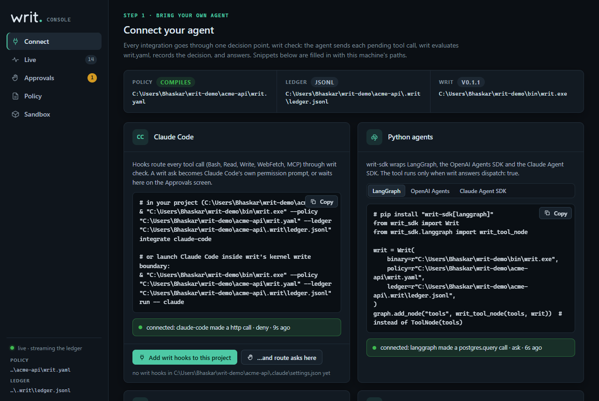
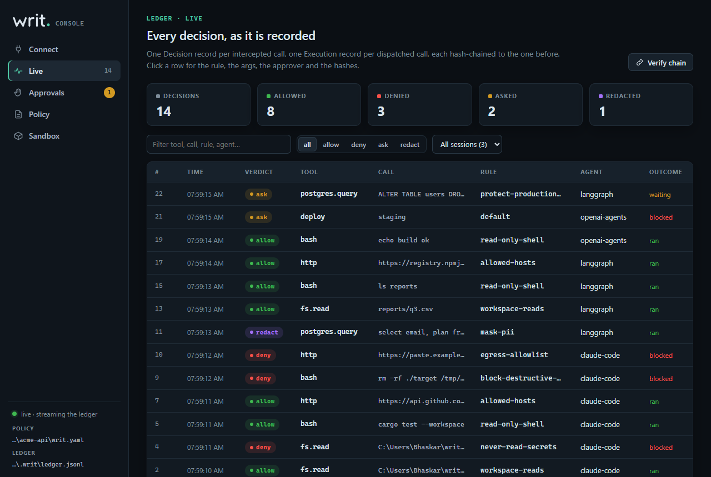
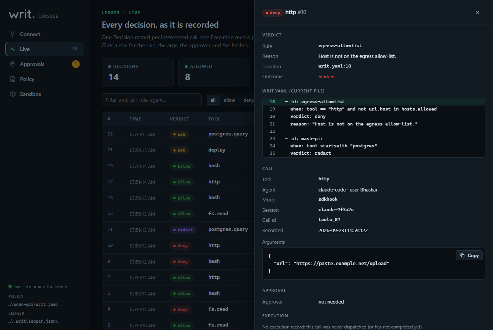
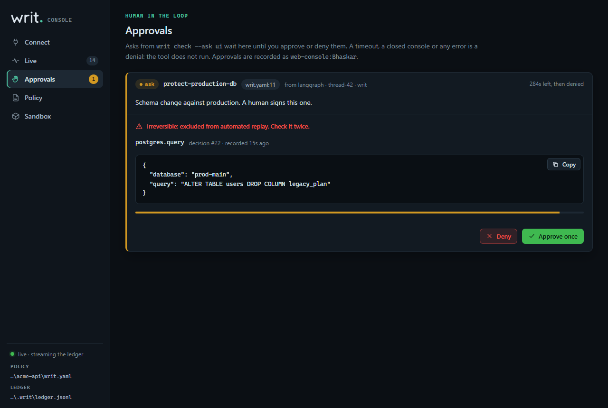
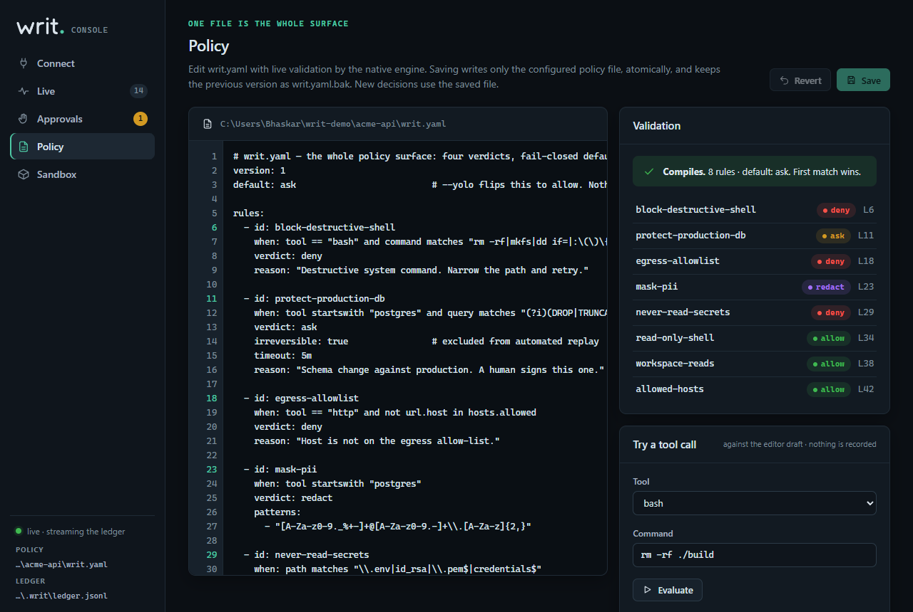
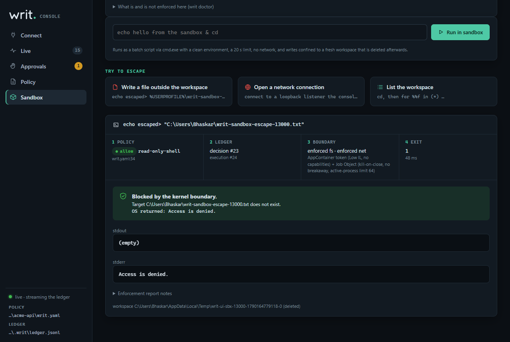
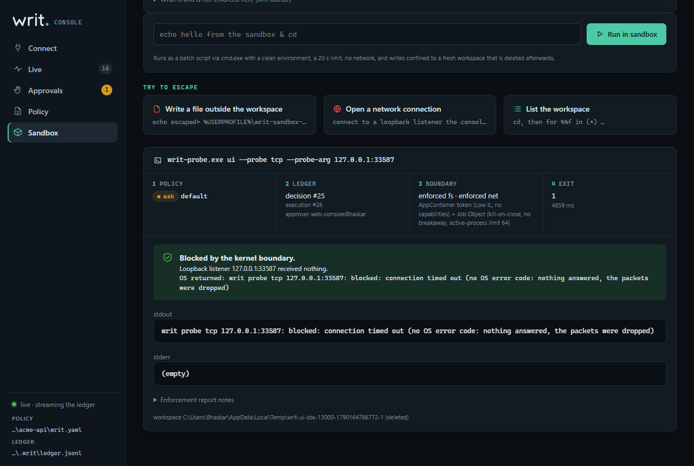

# `writ ui` — the local console

```bash
writ ui                  # serves on 127.0.0.1, opens the browser
writ ui --port 7300      # fixed port (default: a free one)
writ ui --no-open        # print the URL, open nothing
```

`--policy` and `--ledger` work as for every command. The console is one
process with no daemon behind it and no account. It makes no external
requests and sends no telemetry. Every asset (HTML, CSS, JS, the wordmark)
is compiled into the `writ` binary.

## Screens

### Connect your agent



There is one card for each integration: Claude Code, Python (`writ-sdk`
for LangGraph, the OpenAI Agents SDK and the Claude Agent SDK), TypeScript
(`@writ-agent/sdk`), any MCP server (`writ proxy`) and any CLI agent
(`writ run -- <agent>`). Each snippet already has this machine's absolute
paths for the `writ` binary, the policy and the ledger, and uses PowerShell
syntax on Windows.

- **Add writ hooks to this project** runs the same code as
  `writ integrate claude-code`. It merges writ's hooks into
  `<cwd>/.claude/settings.json`, keeps every other setting, and writes the
  file atomically.
- **…and route asks here** writes the same hooks with `--ask ui`. A writ
  `ask` then waits on the Approvals screen instead of Claude Code's own
  prompt.
- The status line reads the ledger. It says *waiting for your agent's
  first tool call…* until a decision from that kind of integration is
  recorded, then *connected: claude-code made a Bash call*. Decisions
  recorded before the console started are shown as *last seen*.

### Live



This screen streams the ledger as it is written. It works with JSONL and
SQLite ledgers and only reads them: the console does not lock, repair or
append to the ledger. The one exception is its own sandbox runs, which are
recorded through the same `LedgerWriter` path as every other writer. You
can filter by text, verdict and session. Clicking a row (or pressing Enter
on it) opens the full record:

- the rule, the reason and `writ.yaml:LINE`, next to that part of the
  current policy file;
- the call's arguments, agent, mode, session and MCP server;
- the approver;
- the execution record: backend, exit status and output hash;
- `input_hash`, `prev_hash` and `record_hash`.



**Verify chain** runs the same check as `writ verify`. It reports either
*chain intact · N records* or the record where the chain breaks.

### Approvals



This screen shows asks from `writ check --ask ui` (see [below](#writ-check---ask-ui)).
Each ask shows the rule, the reason, the location, the arguments exactly as
the ledger recorded them, an irreversible warning where it applies, and a
countdown. **Approve once** or **Deny**. If you do nothing, the ask is
denied when the countdown ends.

### Policy



- Edit `writ.yaml`. The native engine compiles the draft as you type.
  Errors show their line, and **Go to line** takes you there. The rule list
  jumps to each rule.
- **Save** (Ctrl+S) writes only the configured policy file. The draft must
  compile. The file on disk must still be the version the editor loaded
  (otherwise you get `409` and a reload prompt). The previous version is
  kept as `writ.yaml.bak`, and both writes are atomic (temp file, then
  rename).
- **Try a tool call** evaluates a `bash`, `fs.read`, `fs.write`, `http`,
  MCP server/tool or custom call against the *editor draft*. It shows the
  verdict, the rule, the line and the reason, and **writes nothing to the
  ledger**.
- **Policy packs** lists the packs in `packs/`, which are compiled into the
  binary. **Insert** puts a pack's rules at the top of `rules:`, so they
  match first. Review the result, then save.

### Sandbox



This screen runs one command inside the `local-os` kernel boundary
(`LocalOsBackend`: prepare → exec → collect → teardown). The command runs in
a fresh workspace under the system temp directory, which is deleted
afterwards. It gets a clean environment, a 20 s limit and no network. On
Windows the command runs through `cmd.exe` as a batch script; elsewhere it
runs through `/bin/sh -c`.

Each command passes through the whole pipeline:

1. **Policy.** The command is evaluated as tool `bash` with
   `args.command = <command>`. If the verdict is `ask`, the screen shows it
   first. The command runs only if you click *Approve and run*, and the
   decision records the approver `web-console:<user>`. If you cancel,
   nothing is recorded.
2. **Ledger.** One Decision record. A denied command stops here.
3. **Boundary.** `EnforcementMode::Required`, the fail-closed default. If
   this kernel cannot enforce both the write boundary and deny-all network,
   the screen says so and refuses. There is no best-effort or unconfined
   path from the console.
4. **Execution record.** The exit status and a SHA-256 of stdout and
   stderr. The output is shown (masked, for a `redact` verdict) and not
   stored.

**Try to escape** runs one of three fixed demos. Each one is also decided
by the policy and recorded:

| Demo | What it does | Expected result |
|---|---|---|
| Write a file outside the workspace | `echo escaped> %USERPROFILE%\writ-sandbox-escape-<pid>.txt` (`~/…` on Unix) | `Access is denied.` (Windows) / `Permission denied` (Linux Landlock). The console then checks that the file does not exist, and deletes it if it does. |
| Open a network connection | runs `writ ui --probe tcp` against a loopback listener owned by the console (on Windows, from a copy of `writ` in the workspace, because an AppContainer can only execute images it can read) | the probe prints exactly what the OS returned: on Linux `Operation not permitted (os error 1)` (seccomp denies `socket()`); on Windows the AppContainer filter drops the packets, so the connect times out with no error code. The console checks that its listener accepted nothing. No external traffic is attempted. |
| List the workspace | `cd` + `for %%f in (*) …` (Windows; `dir` itself is denied inside an AppContainer because it reads outside the workspace) / `pwd && ls -la` | the throwaway workspace and nothing else |



If an escape succeeds, the screen says so in red. Nothing is reported as
held without that check from outside.

## Security model

The console can edit your policy, approve asks, and run commands in the
sandbox, so it is protected like any other local control plane.

- **Loopback only.** The server binds `127.0.0.1` and drops any peer that
  is not a loopback address.
- **Session token.** Each start draws 256 bits from the OS RNG. The opened
  URL carries it in the fragment (`/#token=…`). A browser never sends a
  fragment to a server or includes it in a `Referer`. The page moves the
  token to `sessionStorage`, removes it from the address bar, and sends it
  as `X-Writ-Token` on every API call. The server compares it in constant
  time. Static assets need no token and contain no secrets.
- **DNS-rebinding defence.** `Host` must be exactly `127.0.0.1:<port>` or
  `localhost:<port>`; anything else gets `421`.
- **Cross-origin defence.** An `Origin` header, when present, must be the
  console's own origin, and `Sec-Fetch-Site: cross-site` is refused (`403`).
  No CORS headers are ever sent. The custom token header also forces a
  preflight that the server never approves.
- **State changes** are `POST` with `Content-Type: application/json` only
  (`415` otherwise, `405` for the wrong method). Bodies need
  `Content-Length`, at most 2 MiB. Chunked bodies are refused.
- **Headers on every response:**
  `Content-Security-Policy: default-src 'none'; script-src 'self'; style-src 'self'; img-src 'self' data:; font-src 'self'; connect-src 'self'; manifest-src 'self'; base-uri 'none'; form-action 'none'; frame-ancestors 'none'`
  (no inline script or style, no remote origin),
  `X-Content-Type-Options: nosniff`, `Referrer-Policy: no-referrer`,
  `X-Frame-Options: DENY`, `Cross-Origin-Opener-Policy: same-origin`,
  `Cross-Origin-Resource-Policy: same-origin`, `Cache-Control: no-store`.
- **Rendering.** Everything that comes from the ledger or an agent
  (arguments, reasons, tool names) is inserted as text, never as HTML.
- **Limits.** One sandbox run at a time. At most 64 concurrent connections.
  A 15 s read timeout.

Residual risks:

- The token appears once on the command line of the browser process that
  `writ ui` starts. Other processes of the same user can read that command
  line. Any process running as you can also read your policy and ledger,
  which is inside the threat model's operator boundary.
- The console is as trusted as the user running it. A malicious local
  operator is out of scope ([THREAT_MODEL.md](THREAT_MODEL.md)).

## `writ check --ask ui`

`--ask` takes `deny` (default, fail closed), `defer` (the agent's own UI
asks) or `ui` (the web console asks).

```
agent ──decide──▶ writ check --ask ui
                    1. evaluate; write the Decision record (verdict ask, no approver)
                    2. console heartbeat fresh?            no → deny now
                    3. write <ledger dir>/pending/<id>.json (atomic)
                    4. wait for <console dir>/decisions/<id>.json
                       until the rule's timeout (default 120 s)
                    5. remove the request file
                  ◀── allow + ref carrying the approver   (approved)
                  ◀── deny, verdict "ask", reason           (denied / timeout / no console / error)
agent ──complete(ref)──▶ Execution record, approver {kind: tui, id: "web-console:<user>"}
```

- `<id>` is `<decision index>-<first 16 hex of its record_hash>`.
- **Where the answers live.** The console writes its heartbeat and its
  decisions to a per-user state directory:
  `%LOCALAPPDATA%\writ\ui\<key>\` on Windows,
  `$XDG_STATE_HOME/writ/ui/<key>/` (or `~/.local/state/writ/ui/<key>/`)
  elsewhere, where `<key>` comes from a SHA-256 of the canonical ledger
  path. It does not write next to the ledger. The reason is that `writ run`
  makes the ledger directory writable by the agent, because hooks run
  inside the boundary and append there. If answers lived next to the
  ledger, a confined agent could approve its own asks. `writ run` never
  grants the state directory. The gateway only reads it, and refuses a
  state directory inside its ledger directory or working directory.
- **What the console shows.** The request file only names a ledger record
  (index and hash). The console displays the call from the ledger record,
  which is hash-chained, and ignores requests that do not match an open
  `ask` (a Decision with no approver and no execution). A forged or edited
  request cannot change what you approve.
- **What counts as approval.** Only a decision file that names this exact
  record hash and carries an approver `web-console:<user>`. Anything else
  is treated as no answer: the timeout expires, a closed console makes the
  heartbeat go stale (more than 10 s old), a file does not parse, or an I/O
  error occurs. All of these deny.
- **On the ledger.** The same semantics as `--ask defer`. The Decision
  record (the engine verdict `ask`) is written *before* the wait, so a
  pending ask is already on the record, and the Live screen shows it as
  `waiting`. An approval is evidenced by the Execution record at
  `complete` (or `PostToolUse`), whose approver is
  `{kind: "tui", id: "web-console:<user>"}`. A denial writes nothing
  further: an `ask` with no execution means the call never ran.
- **Protocol.** `decide` answers with a final decision, never
  `approval: "required"`. An approval returns `decision: "allow"`,
  `dispatch: true`, an `approver` field and a ref for `complete`. A denial
  returns `decision: "deny"`, `verdict: "ask"` and the reason (for
  example `denied in the writ ui web console by web-console:alice`,
  `no decision from the writ ui console within 30000ms`,
  `no writ ui console is running for this ledger`). `resolve` is
  `invalid_state` under `--ask ui`.
- **Claude Code** (`--format claude-code --ask ui`). An approval returns
  `permissionDecision: "allow"`; everything else returns `"deny"` with exit
  code 2. The wait is capped at 55 s. Claude Code does not block a tool
  when a hook times out, so writ must answer first. The `PostToolUse` hook
  records the console's approver, and refuses to record a tool that ran
  without that approval.
- **Blocking.** A `--stdio` gateway answers requests in order, so a waiting
  ask delays the requests behind it in the same process.

Codex, Gemini CLI, Cursor and Windsurf hook formats treat `--ask ui` as
`--ask deny` for now.
